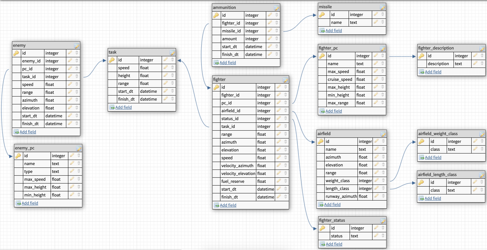

# Пункт наведения ИАП

## Теория

## БД



Основные сущности:
* Задачи (таблица `task`)
* Истребители (таблица `fighter`)
* СВН (таблица `enemy`)

История и динамичность обеспечиваются с помощью полей `start_dt` и `finish_dt`

### Старт сервера

Работаем с `postgresql@9.6`. Для запуска сервера с базой используется команда:
```
pg_ctl -D /usr/local/var/postgresql@9.6 start
```

### Создание структуры БД

### Заполнение данных

### Демонстрация работы запросов
